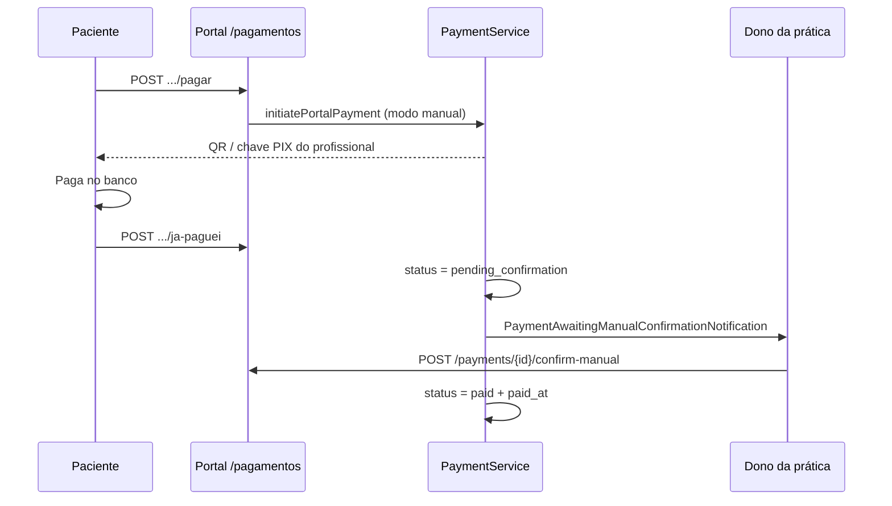

# PsiConecta — Documentação da Aplicação

> Fluxos, funcionalidades, regras de negócio, modelo de dados e políticas de acesso.  
> Última atualização: julho de 2026.  
> **Índice completo:** [README.md](README.md) · [REQUISITOS.md](REQUISITOS.md) · [INSTALACAO.md](INSTALACAO.md) · [CONFIGURACAO.md](CONFIGURACAO.md) · [COMUNICACAO.md](COMUNICACAO.md)

---

## Índice

1. [Visão geral](#1-visão-geral)


2. [Perfis e acesso](#2-perfis-e-acesso)
3. [Autenticação e onboarding](#3-autenticação-e-onboarding)
4. [Área do profissional](#4-área-do-profissional)
5. [Área do paciente](#5-área-do-paciente)
6. [Conformidade / Admin LGPD](#6-conformidade--admin-lgpd)
7. [Documentos e solicitações](#7-documentos-e-solicitações)
8. [API REST v1](#8-api-rest-v1)
9. [Regras de negócio transversais](#9-regras-de-negócio-transversais)
10. [Modelo de dados (ERD)](#10-modelo-de-dados-erd)
11. [Catálogo de entidades](#11-catálogo-de-entidades)
12. [Máquinas de estado (enums)](#12-máquinas-de-estado-enums)
13. [Matriz de permissões](#13-matriz-de-permissões)
14. [Camada de serviços](#14-camada-de-serviços)
15. [Jornadas de utilizador](#15-jornadas-de-utilizador)
16. [Segurança e privacidade](#16-segurança-e-privacidade)
17. [Integrações externas](#17-integrações-externas)
18. [Mapa de rotas](#18-mapa-de-rotas)
19. [Limitações actuais](#19-limitações-actuais)
20. [Stack técnica](#20-stack-técnica)
21. [Monetização e pagamentos](#21-monetização-e-pagamentos)

---

## 1. Visão geral

O **PsiConecta** é uma plataforma Laravel para gestão clínica de psicologia. Cada profissional opera num **consultório isolado** (`professional_id`): pacientes, sessões, prontuários, pagamentos e documentos pertencem exclusivamente ao profissional responsável.

### Módulos principais

| Área | Módulos |
|------|---------|
| Clínico | Dashboard, Agenda, Pacientes, Sessões, Anamnese, Prontuário, Mensagens |
| Gestão | Financeiro, Relatórios, IA Assistente, Bloqueios de agenda |
| Paciente | Portal do utente, Privacidade LGPD |
| Conformidade | Métricas LGPD, Auditoria, Solicitações de titulares |
| Integração | API REST v1, Webhook WhatsApp, OpenAPI |

---

## 2. Perfis e acesso

| Perfil | Enum | Área principal |
|--------|------|----------------|
| **Profissional** | `professional` | Dashboard e módulos clínicos |
| **Paciente** | `patient` | Portal `/area-paciente` |
| **Administrador** | `admin` | Dashboard + módulos LGPD |
| **Agente de suporte** | `support_agent` | Mesa `/admin/suporte` |
| **DPO** | Utilizador com e-mail = `compliance.lgpd.dpo_email` | Gestão LGPD (sem ser admin) |

### Redirecionamento após login

Método `User::defaultAppRouteName()`:

- **Admin** → `dashboard`
- **Profissional** → `dashboard`
- **Paciente** → `patient.home`
- **Profissional mal registado** → `patient.home` (ver secção 3.2)

### Middleware

| Middleware | Função |
|------------|--------|
| `auth` | Utilizador autenticado |
| `verified` | E-mail verificado |
| `professional` | Bloqueia área clínica a pacientes |
| `patient.portal` | Restringe rotas LGPD do paciente |
| `lgpd.admin` | Admin ou DPO |
| `professional.api` | API só para profissionais |
| `support.desk` | Mesa de suporte (admin ou `support_agent`) |
| `subscription.feature:*` | Bloqueia acções se assinatura inactiva ou plano sem feature |

---

## 3. Autenticação e onboarding

### Rotas públicas

| Rota | Descrição |
|------|-----------|
| `/` | Landing ou redirecionamento conforme perfil |
| `/login`, `/register` | Autenticação (Laravel Breeze) |
| `/auth/{google\|facebook}/redirect` | Início OAuth (Socialite) |
| `/auth/{provider}/callback` | Callback OAuth |
| `/auth/social/complete` | Conclusão de registo social (termos + função) |
| `/portal/activar/{token}` | Activação convite portal paciente |
| `/termos` | Termos de utilização |
| `/privacidade` | Política de privacidade |
| `/privacidade/dpia-ia` | DPIA — uso de IA |

### Login social (Google / Facebook)

- **Laravel Socialite**; botões ocultos se credenciais vazias no `.env`
- Conta existente (mesmo e-mail ou `social_accounts`) → login e vinculação
- Conta nova → `/auth/social/complete` (termos + função ou paciente automático)
- `users.password` nullable; definir senha no perfil para contas só sociais
- Modelo `SocialAccount` — ver [CONFIGURACAO.md](CONFIGURACAO.md) secção 10

### Registo

- Nome, e-mail, palavra-passe, aceitação de termos
- **Função profissional** obrigatória (`UserProfessionalFunction`) — excepto caso especial abaixo
- E-mail único (`UniqueUserEmail`)

### Regra: profissional vs paciente no registo

Se o e-mail já existe na ficha de paciente de **exactamente um** consultório:

- A conta é criada como **paciente** desse profissional (`professional_id` preenchido)
- Não exige função profissional

Se o e-mail existe em **zero** ou **mais de um** consultório:

- Registo normal como **profissional**

### Profissional mal registado

Utilizador com role `professional`, **sem pacientes próprios**, mas com e-mail na ficha de **um único** outro profissional:

- `usesPatientPortalExperience()` → true
- Redirecionado para portal do paciente, não área clínica
- Middleware `professional` bloqueia acesso clínico

---

## 4. Área do profissional

**Middleware:** `auth` + `verified` + `professional`

### 4.1 Dashboard (`/dashboard`)

- Resumo: pacientes, sessões, receita
- Agenda do dia
- Tendências: sessões (14 dias), receita paga (7 dias)
- **Serviço:** `DashboardService`

### 4.2 Agenda (`/agenda`)

- Calendário mensal (sessões + bloqueios)
- Painel de relatório com métricas do período
- Filtros: status, tipo, paciente, datas (desde/até), busca por nome
- Exportação **PDF** e **Excel** (identidade visual do portal)
- Chips de sessão por status:
  - Violeta = agendada
  - Verde = concluída
  - Vermelho riscado = cancelada
- Hover em sessões agendadas: marcar **concluída** ou **cancelada**
- Legenda de cores acima do calendário

**Serviços:** `TherapySessionReportService`, `TherapySessionExportService`, `MonthGridCalendar`

### 4.3 Sessões (`/therapy-sessions`)

Funcionalidades equivalentes à agenda, mais:

- CRUD completo de sessões
- Lista paginada filtrada (10/15/25/50 por página)
- Coluna de tipo (online/presencial) na lista
- Exportação PDF/Excel

#### Campos da sessão

| Campo | Tipo |
|-------|------|
| `patient_id` | FK Patient |
| `session_date` | Data |
| `session_time` | Hora |
| `status` | `scheduled` \| `completed` \| `cancelled` |
| `type` | `online` \| `in_person` |
| `notes` | Texto opcional |

#### Regras de conflito de horário (`ScheduleConflictService`)

- Duração estimada: **50 minutos**
- Sessões **canceladas** não bloqueiam horário
- Não permite sobreposição com outra sessão não cancelada no mesmo dia
- Não permite agendar dentro de **bloqueio** de agenda
- Validação em `store` e `update` do controller

#### Atualização rápida de status

- Rota: `PATCH /therapy-sessions/{id}/status`
- Aceita apenas `completed` ou `cancelled`
- Redireciona de volta com mensagem flash

### 4.4 Bloqueios (`/schedule-blocks`)

- CRUD (sem página `show`)
- Campos: data, hora início, hora fim, motivo
- Impedem novos agendamentos no intervalo

### 4.5 Pacientes (`/patients`)

#### Lista

- Avatar, busca, paginação (10/15/25/50)
- **Serviço:** `PatientService`

#### CRUD — validações

- CPF válido e **único por profissional**
- Telefone BR válido
- CEP válido + lookup via API interna
- Morada completa opcional

#### Dados sensíveis (encriptados)

- E-mail, telefone, CPF, notas
- Hashes: `email_hash`, `phone_hash`, `cpf_hash`

#### Ficha do paciente (`/patients/{id}`)

| Aba | Conteúdo |
|-----|----------|
| **Resumo** | Registo, anamnese, sessões recentes, resumo prontuário, resumo financeiro |
| **Prontuário** | Histórico paginado de registos clínicos |
| **Financeiro** | Histórico de pagamentos, totais recebido/pendente/atraso |
| **Documentos e solicitações** | Ofícios, anexos, PDF, e-mail |

**Ações rápidas:** agendar sessão, novo prontuário, editar, excluir.

### 4.6 Anamnese (`/anamnesis-forms`)

- Formulários personalizados com perguntas ordenadas
- Na ficha: preenchimento por formulário seleccionado
- Guardado em `PatientAnamnesis` (JSON de respostas)

### 4.7 Prontuário (`/clinical-records`)

- CRUD de registos clínicos
- **Conteúdo encriptado** (`content`)
- Vinculado a paciente + profissional
- Criação com **apoio opcional de IA** (transcrição / geração de texto)
- Logs de acesso: `RecordAccessLog`
- Redirecionamento IA → formulário pré-preenchido

### 4.8 Financeiro (`/payments`)

| Campo | Valores |
|-------|---------|
| `status` | `pending`, `pending_confirmation`, `paid`, `overdue`, `cancelled`, `refunded` |
| `payment_method` | `pix`, `card` (opcional — paciente escolhe no portal se vazio; no PIX manual fica `pix`) |
| `gateway` | `manual`, `asaas` |
| `therapy_session_id` | Opcional |

- Filtros: status, paciente, datas, busca por nome
- Paginação configurável
- Link na ficha do paciente (aba Financeiro + resumo)
- **Cobrança automática:** ao criar sessão (`TherapySessionObserver` → `PaymentService::createFromSession`) se `PAYMENT_AUTO_CHARGE_ON_SESSION=true`
- **Split:** percentual plataforma (`PAYMENT_PLATFORM_FEE_PERCENT`); repasse ao **dono da prática** (`clinicalPracticeId` / `clinic_owner_id === null`) via Asaas quando `ASAAS_SPLIT_ENABLED` e `users.asaas_wallet_id` do dono definido — **não** usa a wallet do membro da equipa
- **Confirmação manual:** em `pending_confirmation`, o dono (ou quem pode actualizar o pagamento) confirma com `POST /payments/{id}/confirm-manual` → `paid`
- Preferência de recebimento e PIX manual configuram-se no **perfil do dono** (ver [§21 — Modo híbrido](#modo-hibrido-asaas-pix-manual))

**Serviços:** `PaymentService`, `PaymentSettingsService`

### 4.9 Relatórios (`/relatorios`)

- Gráficos: sessões/mês, receita/mês, pacientes activos (6 meses)
- **Serviço:** `ReportService`

### 4.10 IA Assistente (`/ia-assistente`)

| Tipo | Descrição |
|------|-----------|
| `transcricao` | Transcrição de áudio |
| `texto_abordagem` | Texto por abordagem clínica |
| `recomendacao_terapeuta` | Recomendação de encaminhamento |

Funcionalidades:

- Histórico de pedidos (`AiRequest`)
- Métricas do dia (análises, textos, transcrições, recomendações)
- Guardar resultado no prontuário
- Consentimento LGPD obrigatório para áudio
- Rate limiting por endpoint

**Serviço:** `AiAssistantService`

### 4.11 Mensagens (`/mensagens`)

- Mensagens internas encriptadas (`body`)
- **Profissional →** pacientes com `professional_id` ou e-mail coincidente na ficha
- **Paciente →** terapeuta (`professional_id`)
- **Admin →** qualquer utilizador
- Links externos: e-mail e WhatsApp (contactos da ficha)
- Auditoria no envio (`AuditTrail`)

### 4.12 Perfil (`/profile`)

- Dados da conta, palavra-passe
- Avatar (forma, anel, filtro)
- **Ficheiros profissionais** (bio, certificados) — upload/download/delete
- Bio profissional (`professional_bio`)
- **Assinatura da plataforma** — estado, validade, link para `/assinatura`

### 4.14 Assinatura SaaS (`/assinatura`)

- Planos pagos: Essencial, Premium, Clínica
- Checkout PIX ou cartão via Asaas (`SubscriptionService::initiateCheckout`)
- **Upgrade:** cancela subscrição anterior no gateway e cria nova
- **Cancelamento:** `DELETE /assinatura` — para renovação no Asaas; acesso mantém-se até `ends_at`
- Trial 14 dias no registo (`SubscriptionService::startTrial`)
- Middleware `subscription.feature:*` bloqueia criar paciente/sessão/prontuário/IA se inactivo ou plano sem feature

#### Matriz de features por plano

| Feature | Trial | Essencial | Premium | Clínica |
|---------|-------|-----------|---------|---------|
| Pacientes / sessões / prontuário | ✓ | ✓ | ✓ | ✓ |
| IA clínica (`use_ai`) | ✓ | — | ✓ | ✓ |
| Multi-utilizador (`multi_user`) | — | — | — | ✓ |
| Limite de pacientes | 10 | 50 | ilimitado | ilimitado |

- **Limite de pacientes:** `PatientPolicy::create` + `SubscriptionService::canAddPatient()`; UI em sidebar, dashboard, `/patients` e banner de assinatura (`x-patient-quota-alert`)
- **IA:** menu e rotas GET/POST protegidas; painel IA oculto em prontuário no Essencial
- **Equipa:** downgrade Clínica → Premium (ou assinatura inactiva) desliga membros (`ClinicTeamService::releaseTeamIfUnavailable`) e remove convites pendentes

**Serviço:** `SubscriptionService` · **Banner:** `x-subscription-banner`

### 4.13 API interna

| Rota | Uso |
|------|-----|
| `GET /api/cep/{cep}` | Lookup de morada (throttle 40/min) |

---

## 5. Área do paciente

**Middleware:** `auth` + `verified`

### Portal (`/area-paciente`)

- Informação do terapeuta vinculado
- Layout dedicado (sem menu clínico)

### Privacidade LGPD (`/area-paciente/privacidade`)

**Middleware adicional:** `patient.portal`

| Tipo de pedido | Descrição |
|----------------|-----------|
| `acesso` | Confirmação e acesso aos dados |
| `correcao` | Correção de dados |
| `eliminacao` | Eliminação de dados |
| `portabilidade` | Exportação/portabilidade |
| `oposicao` | Oposição ao tratamento |
| `revogacao` | Revogação de consentimento |

- Exportação JSON e PDF
- Throttle restritivo nos exports (5/hora)

### Pagamentos (`/area-paciente/pagamentos`)

| Rota | Acção |
|------|-------|
| `GET .../pagamentos` | Lista de cobranças do paciente |
| `GET .../pagamentos/{id}` | Detalhe + QR PIX (Asaas ou manual) ou link cartão |
| `POST .../pagamentos/{id}/pagar` | Inicia checkout (`PaymentService::initiatePortalPayment`) — Asaas **ou** PIX manual |
| `POST .../pagamentos/{id}/ja-paguei` | PIX manual: paciente declara pagamento → `pending_confirmation` |

- Se o checkout for **Asaas** e `payment_method` estiver vazio, o paciente **escolhe PIX ou cartão** antes de pagar
- Se o checkout for **PIX manual**, mostra chave/link + QR do profissional; cartão Asaas **não** está disponível
- Webhook `POST /webhooks/asaas` confirma pagamento Asaas (`PaymentService::confirmFromWebhook`)
- PIX manual **não** usa webhook — confirmação humana pelo profissional (ver [§21](#modo-hibrido-asaas-pix-manual))

---

## 6. Conformidade / Admin LGPD

**Acesso:** `canManageLgpdRequests()` — Admin **ou** e-mail DPO configurado.

| Rota | Função |
|------|--------|
| `/admin/lgpd/metricas` | KPIs, SLA, totais por estado |
| `/admin/lgpd/auditoria` | Logs de auditoria + export |
| `/admin/lgpd/acessibilidade` | Relatório de acessibilidade |
| `/admin/lgpd/solicitacoes` | Gestão de pedidos de titulares |

**Auditoria global:** `AuditTrail` — acções sensíveis (ver paciente, enviar mensagem, etc.)

---

## 7. Documentos e solicitações

**Nested resource:** `/patients/{patient}/document-requests`

### Fluxo

1. Criar `DocumentRequest` (instituição, documentos pedidos, motivo)
2. Gerar **PDF** do ofício (logo/branding)
3. Opcional: **enviar e-mail** (registado em `last_email_sent_at`)
4. Anexar ficheiros → `DocumentRequestFile` / `PatientDocument`
5. Actualizar status → `respondido`

### Status

`pendente` → `enviado` → `respondido` | `cancelado`

### Permissões (`DocumentRequestPolicy`)

Admin tem todas. Profissional usa permissões em `Permissions`:

- Visualizar, criar, editar, excluir
- Baixar PDF, enviar e-mail, upload de ficheiros

---

## 8. API REST v1

**Base:** `/api/v1`  
**Autenticação:** Laravel Sanctum (tokens com abilities `api:read` / `api:write`)

| Recurso | GET | POST | PUT/PATCH | DELETE |
|---------|-----|------|-----------|--------|
| Pacientes | ✓ | ✓ | ✓ | ✓ |
| Sessões | ✓ | ✓ | ✓ | ✓ |
| Pagamentos | ✓ | ✓ | ✓ | ✓ |
| Prontuários | ✓ | ✓ | ✓ | ✓ |
| Summary | ✓ | — | — | — |

### Endpoints auxiliares

| Rota | Descrição |
|------|-----------|
| `GET /health` | Health check |
| `GET /openapi.json` | Especificação OpenAPI |
| `POST /integrations/whatsapp/webhook` | Webhook WhatsApp |

**Middleware:** `professional.api`, throttle 120 req/min

---

## 9. Regras de negócio transversais

### Multi-tenancy

Todos os recursos clínicos filtrados por `professional_id`. Route model binding reforça ownership em `Patient`, `TherapySession`, `Payment`, `AnamnesisForm`.

### Vínculo paciente ↔ portal

- Por **e-mail normalizado** entre ficha `Patient` e `User`
- Avatar partilhado (`Patient::avatarOwner()` → User portal ou Patient)

### Rate limiting (principais)

| Acção | Limite |
|-------|--------|
| IA transcrever | 20/min |
| IA gerar texto / recomendar | 30/min |
| LGPD export | 5/hora |
| CEP lookup | 40/min |
| Mensagens | 30/min |
| E-mail ofício | 10/min |

### Exportações agenda/sessões

- Respeitam filtros activos na consulta
- PDF com logo e gradiente violeta/índigo
- Excel via PhpSpreadsheet (`.xlsx`)

---

## 10. Modelo de dados (ERD)

```
User (profissional)
  ├── has many → Patient
  ├── has many → TherapySession
  ├── has many → ScheduleBlock
  ├── has many → ClinicalRecord
  ├── has many → AnamnesisForm
  ├── has many → AiRequest
  ├── has many → DocumentRequest
  ├── has many → UserProfessionalFile
  └── has many → Message (sender/recipient)

Patient
  ├── belongs to → User (professional_id)
  ├── has many → TherapySession
  ├── has many → ClinicalRecord
  ├── has many → Payment
  ├── has many → PatientAnamnesis
  ├── has many → DocumentRequest
  ├── has many → PatientDocument
  └── has many → AiRequest

TherapySession
  ├── belongs to → Patient, User
  └── has one → Payment (opcional)

AnamnesisForm
  ├── has many → AnamnesisQuestion
  └── has many → PatientAnamnesis

DocumentRequest
  ├── has many → DocumentRequestFile
  ├── has many → PatientDocument
  └── has many → DocumentRequestAccessLog

ClinicalRecord
  └── has many → RecordAccessLog
```

---

## 11. Catálogo de entidades

| Entidade | Tabela | Descrição |
|----------|--------|-----------|
| User | `users` | Conta autenticada |
| Patient | `patients` | Ficha do utente |
| TherapySession | `therapy_sessions` | Consulta |
| ScheduleBlock | `schedule_blocks` | Bloqueio de agenda |
| ClinicalRecord | `clinical_records` | Prontuário |
| Payment | `payments` | Pagamento |
| AnamnesisForm | `anamnesis_forms` | Template anamnese |
| AnamnesisQuestion | `anamnesis_questions` | Pergunta |
| PatientAnamnesis | `patient_anamneses` | Respostas |
| DocumentRequest | `document_requests` | Ofício externo |
| DocumentRequestFile | `document_request_files` | Anexo ofício |
| PatientDocument | `patient_documents` | Documento arquivado |
| DocumentRequestAccessLog | `document_request_access_logs` | Auditoria docs |
| AiRequest | `ai_requests` | Pedido IA |
| Message | `messages` | Mensagem interna |
| DataSubjectRequest | `data_subject_requests` | Pedido LGPD |
| AuditLog | `audit_logs` | Auditoria global |
| RecordAccessLog | `record_access_logs` | Acesso prontuário |
| UserProfessionalFile | `user_professional_files` | Ficheiros perfil |

---

## 12. Máquinas de estado (enums)

### TherapySessionStatus

```
scheduled → completed | cancelled
```

### PaymentStatus

```
pending ──────────────────────► paid | overdue | cancelled | refunded
   │
   └─(PIX manual: «Já paguei»)─► pending_confirmation ─(dono confirma)─► paid
                                                              └→ cancelled | overdue (ajuste manual)
```

| Estado | Significado |
|--------|-------------|
| `pending` | Cobrança em aberto (Asaas ainda não pago, ou PIX manual ainda não declarado) |
| `pending_confirmation` | Paciente reportou PIX manual; aguarda confirmação do profissional |
| `paid` | Confirmado (webhook Asaas ou confirmação manual) |
| `overdue` | Em atraso (webhook Asaas ou marcação manual) |
| `cancelled` / `refunded` | Cancelado / reembolsado |

### DocumentRequestStatus

```
pendente → enviado → respondido
         └→ cancelado
```

### DataSubjectRequestStatus

```
pending → in_progress → completed | rejected
```

### AiRequestStatus

```
processing → completed | failed
```

---

## 13. Matriz de permissões

| Policy | viewAny | view | create | update | delete |
|--------|---------|------|--------|--------|--------|
| PatientPolicy | profissional | dono | profissional | dono | dono |
| TherapySessionPolicy | profissional | dono | profissional | dono | dono |
| ScheduleBlockPolicy | profissional | dono | profissional | dono | dono |
| ClinicalRecordPolicy | profissional | dono | profissional | dono | dono |
| PaymentPolicy | profissional | dono | profissional | dono | dono |
| AnamnesisFormPolicy | profissional | dono | profissional | dono | dono |
| AiRequestPolicy | — | criador | profissional | criador | criador |
| DocumentRequestPolicy | prof + permissões | prof + permissões | prof + permissões | prof + permissões | prof + permissões |
| PatientDocumentPolicy | prof (dono paciente) | idem | idem | idem | idem |
| DataSubjectRequestPolicy | titular + admin/DPO | idem | titular | admin/DPO | — |

**"Dono"** = `resource.professional_id === user.id` ou via `patient.professional_id`.

---

## 14. Camada de serviços

| Serviço | Ficheiro | Responsabilidade |
|---------|----------|------------------|
| PatientService | `app/Services/PatientService.php` | CRUD paciente, paginação, avatares |
| ScheduleConflictService | `app/Services/ScheduleConflictService.php` | Conflitos de horário |
| TherapySessionReportService | `app/Services/TherapySessionReportService.php` | Filtros, stats, export context |
| TherapySessionExportService | `app/Services/TherapySessionExportService.php` | PDF/Excel |
| DashboardService | `app/Services/DashboardService.php` | Métricas dashboard |
| ReportService | `app/Services/ReportService.php` | Gráficos /relatorios |
| AiAssistantService | `app/Services/AiAssistantService.php` | Integração IA |
| DocumentRequestService | `app/Services/DocumentRequestService.php` | Solicitações |
| DocumentRequestPdfService | `app/Services/DocumentRequestPdfService.php` | PDF ofício |
| DocumentRequestAccessLogService | `app/Services/DocumentRequestAccessLogService.php` | Logs acesso docs |
| PatientDocumentService | `app/Services/PatientDocumentService.php` | Docs paciente |
| PatientDataExportPdfService | `app/Services/PatientDataExportPdfService.php` | Export LGPD PDF |
| PaymentService | `app/Services/PaymentService.php` | Cobranças clínicas, portal (Asaas + PIX manual), split, confirmação manual |
| PaymentSettingsService | `app/Services/PaymentSettingsService.php` | Resolve `auto` / `asaas` / `manual` para o dono da prática |
| ProfessionalPixSettingsService | `app/Services/ProfessionalPixSettingsService.php` | Grava preferência + chave/QR PIX no perfil do dono |
| SubscriptionService | `app/Services/SubscriptionService.php` | Trial, checkout, cancelamento, webhook |
| AsaasGatewayService | `app/Services/Gateways/AsaasGatewayService.php` | Cliente, cobrança, subscrição, PIX |
| UserAvatarService | `app/Services/UserAvatarService.php` | Avatars |
| AuditTrail | `app/Support/AuditTrail.php` | Helper auditoria |
| PortalBrand | `app/Support/PortalBrand.php` | Logo/branding exports |
| MonthGridCalendar | `app/Support/MonthGridCalendar.php` | Grelha calendário mensal |

---

## 15. Jornadas de utilizador

### Profissional — dia típico

1. Login → Dashboard (agenda do dia, KPIs)
2. Agenda/Sessões → confirmar ou cancelar consultas
3. Ficha paciente → anamnese, prontuário, pagamento
4. IA Assistente → transcrever sessão → guardar no prontuário
5. Financeiro → registar pagamento
6. Exportar relatório mensal (PDF/Excel)

### Paciente

1. Registo (se e-mail na ficha) ou convite
2. Verificação de e-mail
3. Portal → mensagem ao terapeuta
4. Pagamentos → Asaas (PIX/cartão) ou PIX manual do profissional; se manual, «Já paguei» e aguarda confirmação
5. Privacidade → pedido LGPD ou exportação de dados

### Solicitação documental

1. Ficha → aba Documentos → Nova solicitação
2. Preencher instituição e documentos
3. Gerar PDF → enviar e-mail
4. Anexar resposta → status Respondido

---

## 16. Segurança e privacidade

| Medida | Implementação |
|--------|---------------|
| Encriptação at-rest | Laravel Crypt em campos sensíveis |
| Hashes de lookup | email_hash, phone_hash, cpf_hash |
| Route binding scoped | Models com filtro por profissional |
| Verificação e-mail | `MustVerifyEmail` |
| Consentimento IA | `lgpd_consent_at`, IP, checkbox áudio |
| Throttle | Endpoints sensíveis |
| Soft delete | DocumentRequest |
| Access logs | Record, DocumentRequest, AuditLog |
| Termos no registo | `terms_accepted` required |

### Campos encriptados

| Modelo | Campos |
|--------|--------|
| User | email, phone |
| Patient | email, phone, cpf, notes |
| ClinicalRecord | content |
| Message | body |
| DocumentRequest | notes, request_reason |

---

## 17. Integrações externas

| Integração | Endpoint / serviço |
|------------|-------------------|
| CEP / ViaCEP | `GET /api/cep/{cep}` |
| IA (LLM/STT) | `AiAssistantService` |
| WhatsApp | Webhook `/api/v1/integrations/whatsapp/webhook` |
| Sanctum API | `/api/v1/*` |
| OpenAPI | `/api/v1/openapi.json` |
| DomPDF | PDFs (ofícios, exports, LGPD) |
| PhpSpreadsheet | Excel exports |
| **Asaas** | Gateway: assinatura SaaS + cobranças clínicas (PIX/cartão), webhook, split opcional |

**Webhook Asaas:** `POST /webhooks/asaas` · header `asaas-access-token` = `ASAAS_WEBHOOK_TOKEN`

Eventos tratados:

| Evento | Efeito |
|--------|--------|
| `PAYMENT_RECEIVED` / `CONFIRMED` | Pagamento clínico → `paid`; renovação de assinatura → `active` + extensão de `ends_at` (+1 mês ou +1 ano conforme `billing_cycle`) |
| `PAYMENT_OVERDUE` | Assinatura → `past_due`; pagamento clínico → `overdue` |

---

## 18. Mapa de rotas

### Públicas

| Rota | Nome |
|------|------|
| `/` | `home` (landing com secção `#precos` para visitantes) |
| `/termos` | `legal.terms` |
| `/privacidade` | `legal.privacy` |
| `/privacidade/dpia-ia` | `legal.dpia-ai` |

### Profissional (auth + verified + professional)

| Rota | Nome |
|------|------|
| `/dashboard` | `dashboard` |
| `/agenda` | `schedule.index` |
| `/agenda/export/pdf` | `schedule.export.pdf` |
| `/agenda/export/excel` | `schedule.export.excel` |
| `/patients` | `patients.*` |
| `/therapy-sessions` | `therapy-sessions.*` |
| `/therapy-sessions/{id}/status` | `therapy-sessions.update-status` |
| `/therapy-sessions/export/pdf` | `therapy-sessions.export.pdf` |
| `/therapy-sessions/export/excel` | `therapy-sessions.export.excel` |
| `/clinical-records` | `clinical-records.*` |
| `/payments` | `payments.*` |
| `POST /payments/{payment}/confirm-manual` | `payments.confirm-manual` (PIX manual → `paid`) |
| `/anamnesis-forms` | `anamnesis-forms.*` |
| `/schedule-blocks` | `schedule-blocks.*` |
| `/relatorios` | `reports.index` |
| `/ia-assistente` | `ai.*` |
| `/api/cep/{cep}` | `api.cep` |

### Autenticado (todos os perfis)

| Rota | Nome |
|------|------|
| `/mensagens` | `messages.*` |
| `/notificacoes/{id}/abrir` | `notifications.open` (marca como lida + redireciona) |
| `/profile` | `profile.*` |
| `POST /profile/asaas-wallet` | `profile.asaas-wallet.provision` (Connect / carteira split) |
| `POST /profile/payment-settings` | `profile.payment-settings.update` (preferência + PIX manual; só dono) |
| `/assinatura` | `subscription.checkout` |
| `POST /assinatura` | `subscription.checkout.store` |
| `DELETE /assinatura` | `subscription.checkout.cancel` |
| `/area-paciente` | `patient.home` |
| `/area-paciente/privacidade` | `patient.lgpd.*` |
| `/area-paciente/pagamentos` | `patient.payments.*` |
| `POST .../pagamentos/{id}/ja-paguei` | `patient.payments.already-paid` |

### Webhooks (sem auth de sessão)

| Rota | Nome |
|------|------|
| `POST /webhooks/asaas` | `webhooks.asaas` |

### Admin / DPO

| Rota | Nome |
|------|------|
| `/admin/lgpd/metricas` | `admin.lgpd.metrics` |
| `/admin/lgpd/auditoria` | `admin.lgpd.audit` |
| `/admin/lgpd/acessibilidade` | `admin.lgpd.accessibility` |
| `/admin/lgpd/solicitacoes` | `admin.lgpd.requests.*` |

---

## 19. Limitações actuais

- Com `ASAAS_SPLIT_ENABLED=true`, Asaas clínico exige **carteira do dono da prática** (`asaas_wallet_id`); sem wallet cai para PIX manual (se configurado) ou «não configurado»
- PIX manual **não** tem conciliação bancária automática — depende de «Já paguei» + confirmação humana
- Split clínica → terapeuta (reparto interno entre membros) — **não** implementado; o split Asaas é plataforma ↔ dono
- Paciente **não acede** ao prontuário clínico completo (portal: pagamentos, consultas online, conversas, LGPD)
- Admin **não gere** pacientes de outros profissionais na UI clínica
- Plano Clínica: convites de equipa; downgrade/expiração remove membros (`releaseTeamIfUnavailable`)
- Registo via convite de equipa **não** pré-preenche token automaticamente
- Permissões granulares por membro da equipa (leitura vs. edição) — não implementado
- Sign in with Apple — não implementado (web)
- App nativo iOS/Android — não implementado (portal web disponível)

**Já implementado (doc anterior desactualizado):**
- Teleconsulta Jitsi (`JITSI_*`, `/therapy-sessions/{id}/video`, portal consultas online)
- WhatsApp Meta + Evolution com admin UI e chatbot suporte
- Notificações in-app (12+ tipos) + lembretes agendados
- Conversas clínicas, chatbot widget, mesa de suporte
- Modo híbrido Asaas + PIX manual (`payment_method_preference`, confirmação `pending_confirmation`)
- API REST v1 também para paciente (pagamentos, conversas, etc.)

Ver detalhes: [COMUNICACAO.md](COMUNICACAO.md)

---

## 20. Stack técnica

| Componente | Tecnologia |
|------------|------------|
| Framework | Laravel 12 |
| Auth | Laravel Breeze + Sanctum + Socialite (Google/Facebook) |
| Frontend | Blade + Tailwind CSS + Alpine.js |
| PDF | barryvdh/laravel-dompdf |
| Excel | phpoffice/phpspreadsheet |
| Base de dados | MySQL/SQLite (via migrations) |
| Testes | PHPUnit (Feature tests) |

### Estrutura de pastas relevante

```
app/
  Enums/          # Status, tipos, roles
  Http/Controllers/
  Models/
  Policies/
  Services/
  Support/        # Helpers (AuditTrail, MonthGridCalendar, PortalBrand)
docs/
  README.md         # Índice da documentação
  APLICACAO.md      # Este ficheiro
  REQUISITOS.md     # RF/RNF e critérios de aceite
  INSTALACAO.md     # Setup local e deploy
  CONFIGURACAO.md   # Variáveis .env
  COMUNICACAO.md    # Conversas, WhatsApp, chatbot, notificações
resources/views/  # Blade templates
routes/
  web.php         # Rotas web
  api.php         # API v1
  auth.php        # Autenticação
tests/Feature/    # Testes automatizados
```

---

## 21. Monetização e pagamentos

### Dois fluxos de receita

| Fluxo | Quem paga | O quê | Serviço |
|-------|-----------|-------|---------|
| **SaaS** | Profissional | Assinatura mensal ou anual da plataforma | `SubscriptionService` |
| **Clínico** | Paciente | Sessão / consulta | `PaymentService` |

### Planos de assinatura (`subscription_plans`)

| Slug | Mensal | Anual (10 meses) | Destaques |
|------|--------|------------------|-----------|
| `trial` | Grátis | — | 14 dias, IA, máx. 10 pacientes |
| `essencial` | R$ 99 | R$ 990 | Sem IA, máx. 50 pacientes |
| `premium` | R$ 149 | R$ 1.490 | IA, pacientes ilimitados |
| `clinica` | R$ 299 | R$ 2.990 | IA + `multi_user` (equipa) |

Coluna `annual_price_cents` na BD; fallback via `SUBSCRIPTION_ANNUAL_DISCOUNT_PERCENT` se zero.

**Landing (`#precos`):** toggle mensual/anual (Alpine). **Checkout (`/assinatura`):** `billing_cycle` + PIX/cartão → Asaas `MONTHLY` ou `YEARLY`.

**Equipa clínica (plano Clínica):** convites por e-mail · aceitação em `/convite-equipa/{token}` · membros usam `clinicalPracticeId()` para aceder aos dados do titular · assinatura e Asaas só no titular · **downgrade ou expiração** desliga membros automaticamente (`releaseTeamIfUnavailable` no checkout e `psiconecta:expire-subscriptions`).

**Admin:** dashboard focado em LGPD; **não acede** a `/payments` nem a dados financeiros clínicos de consultórios (403 por policy).

### Modo híbrido Asaas + PIX manual
<a id="modo-hibrido-asaas-pix-manual"></a>

Aplica-se **só a pagamentos clínicos** (portal paciente / `PaymentService`). A assinatura SaaS (`/assinatura`) continua **sempre Asaas**.

Não existe model `Clinic`: o pagador/recebedor configurável é o **User dono da prática** (`clinic_owner_id === null`, resolvido via `clinicalPracticeId()` / `PaymentSettingsService::practiceOwnerFor()`). Membros da equipa **não** editam preferência nem PIX; o checkout do paciente usa sempre as settings do dono.

#### Campos em `users` (dono)

| Campo | Valores / uso |
|-------|----------------|
| `payment_method_preference` | `auto` (default) · `asaas` · `manual` |
| `asaas_wallet_id` | Carteira Asaas (Connect ou manual); usada no split |
| `pix_manual_link` | Chave PIX, e-mail, telefone ou URL de pagamento |
| `pix_qrcode_path` | Imagem QR em `storage` (`pix-qrcodes/...`), servida via rota pública de storage |

UI: partial de perfil `payment-gateway-section` · `POST /profile/payment-settings` (`profile.payment-settings.update`).

#### Resolução (`PaymentSettingsService::resolveForPayee`)

| Preferência | Regra |
|-------------|--------|
| **`auto`** | Asaas se disponível; senão PIX manual se configurado; senão «não configurado» |
| **`asaas`** | Só Asaas; se Asaas indisponível → erro «não configurado» (ignora PIX manual) |
| **`manual`** | Só PIX manual; exige `pix_manual_link` ou `pix_qrcode_path` |

**Quando Asaas está «disponível» para o dono:**

- Tem `asaas_wallet_id`, **ou**
- `ASAAS_SPLIT_ENABLED=false` → cobrança na conta da **plataforma** (comportamento histórico; não bloqueia checkout sem carteira)

Com `ASAAS_SPLIT_ENABLED=true` e sem wallet: `auto` cai para PIX manual (se houver); `asaas` fica não configurado.

**Checkout:** `PaymentService::initiatePortalPayment` → ramo Asaas (PIX/cartão + webhook) ou `prepareManualPixCheckout` (copia meta PIX do profissional; `gateway = manual`).

#### Fluxo PIX manual (confirmação humana)



1. Paciente inicia pagamento → vê PIX estático do dono (não gera cobrança Asaas).
2. Após transferir, clica **«Já paguei»** → `pending_confirmation` + notificação ao dono.
3. Dono confere o extrato e **confirma** em `/payments/{id}` → `paid`.
4. Enquanto `pending_confirmation`, o paciente não volta a iniciar checkout Asaas; o profissional pode ainda cancelar/ajustar status na UI financeira.

**Fora de escopo:** conciliação automática com banco; split interno clínica→terapeuta.

### Variáveis de ambiente

| Variável | Uso |
|----------|-----|
| `ASAAS_ENABLED` | Activa chamadas HTTP reais (senão stub local) |
| `ASAAS_API_KEY` | Token Asaas |
| `ASAAS_WEBHOOK_TOKEN` | Validação do webhook |
| `ASAAS_SPLIT_ENABLED` | Repasse ao profissional em cobranças clínicas |
| `ASAAS_CONNECT_ENABLED` | Criação de subconta/carteira no perfil |
| `ASAAS_CONNECT_*` | Morada default opcional para Connect |
| `PAYMENT_PLATFORM_FEE_PERCENT` | Comissão da plataforma (ex.: 10%) |
| `PAYMENT_AUTO_CHARGE_ON_SESSION` | Gera cobrança ao criar sessão |
| `PAYMENT_PATIENT_NOTIFICATIONS_ENABLED` | E-mail/notificação in-app ao paciente |
| `PAYMENT_PATIENT_REMINDER_DAYS` | Dias até lembrete de cobrança pendente |
| `PAYMENT_PROFESSIONAL_NOTIFICATIONS_ENABLED` | E-mail/notificação ao profissional (pago/atraso) |
| `CLINIC_MAX_TEAM_MEMBERS` | Limite de membros por clínica (default 5) |
| `CLINIC_INVITATION_EXPIRES_DAYS` | Validade do convite de equipa |
| `SUBSCRIPTION_TRIAL_DAYS` | Duração do trial |
| `SUBSCRIPTION_EXPIRING_SOON_DAYS` | Janela de lembrete antes de expirar |
| `SUBSCRIPTION_ANNUAL_DISCOUNT_PERCENT` | Desconto fallback se `annual_price_cents` = 0 |
| `users.asaas_wallet_id` | Carteira Asaas do **dono** (perfil / Connect) |
| `users.payment_method_preference` | `auto` \| `asaas` \| `manual` (só dono edita) |
| `users.pix_manual_link` / `pix_qrcode_path` | PIX estático para checkout manual |
| `users.phone` | Obrigatório para Connect em produção (≥10 dígitos) |

**Comandos agendados:**

| Comando | Horário | Função |
|---------|---------|--------|
| `psiconecta:expire-subscriptions` | 00:30 | Trial/`ends_at` ultrapassado → `expired` |
| `psiconecta:subscription-reminders` | 08:00 | E-mail + notificação in-app (expira em ≤ `SUBSCRIPTION_EXPIRING_SOON_DAYS`) |
| `psiconecta:payment-reminders` | 09:00 | Lembretes de cobranças clínicas pendentes aos pacientes com portal |

**Notificações ao paciente:** `PatientPaymentDueNotification` (mail + database) — nova cobrança, lembrete (`PAYMENT_PATIENT_REMINDER_DAYS`) e atraso (`PAYMENT_OVERDUE`). Link in-app → `/area-paciente/pagamentos/{id}`.

**Notificações ao profissional:** `ProfessionalClinicalPaymentNotification` — pagamento confirmado ou em atraso via webhook. Link in-app → `/payments/{id}` (`PAYMENT_PROFESSIONAL_NOTIFICATIONS_ENABLED`).  
**PIX manual:** `PaymentAwaitingManualConfirmationNotification` quando o paciente declara «Já paguei».

**Asaas Connect:** `POST /profile/asaas-wallet` · CPF/CNPJ, CEP (autofill ViaCEP), morada, número, bairro · telefone no perfil. Stub sem credenciais.

**Portal paciente:** `/area-paciente` mostra card de cobranças pendentes; `/area-paciente/pagamentos` — Asaas (PIX/cartão) ou PIX manual conforme resolução do dono; «Já paguei» só no ramo manual.

**Dashboard profissional:** alerta de cobranças pendentes (`x-pending-payments-alert`), painel de split mensal (`x-clinical-revenue-split-panel`: bruto, repasse, comissão), banner de assinatura, feed de notificações.

### Componentes UI de checkout

| Componente | Uso |
|------------|-----|
| `x-payment-method-selector` | Escolha PIX vs cartão |
| `x-billing-cycle-selector` | Mensal vs anual (checkout assinatura) |
| `x-pix-checkout-panel` | QR Code + copiar código |
| `x-card-checkout-panel` | Link `invoiceUrl` Asaas |
| `x-subscription-banner` | Aviso trial/expiração no dashboard (com CTA «Renovar») |
| `x-pending-payments-alert` | Cobranças clínicas pendentes no dashboard |
| `x-notifications-feed` | Lista in-app de notificações (dashboard) |

### Diagrama simplificado

```mermaid
flowchart LR
    subgraph SaaS
        Pro[Profissional] --> Sub[/assinatura]
        Sub --> AsaasSub[Asaas Subscription]
        AsaasSub --> Webhook
    end
    subgraph Clinico
        Pac[Paciente] --> Portal[/area-paciente/pagamentos]
        Portal --> Resolve{PaymentSettingsService}
        Resolve -->|asaas| AsaasPay[Asaas Payment]
        Resolve -->|manual| PixManual[PIX estático + Já paguei]
        AsaasPay --> Split[Split opcional wallet do dono]
        AsaasPay --> Webhook
        PixManual --> Confirm[Dono confirma manual]
        Confirm --> PaySvc
    end
    Webhook[POST /webhooks/asaas] --> PaySvc[PaymentService]
    Webhook --> SubSvc[SubscriptionService]
```

---

## Apêndice A — Ficha do paciente (abas)

| Query `?tab=` | Valor | Secção |
|---------------|-------|--------|
| (default) | `overview` | Resumo, anamnese, sessões, prontuário resumo, financeiro resumo |
| Prontuário | `clinical-records` | Histórico paginado |
| Financeiro | `payments` | Histórico paginado + totais |
| Documentos | `document-requests` | Ofícios e anexos |

---

## Apêndice B — Componentes UI reutilizáveis (principais)

| Componente | Uso |
|------------|-----|
| `x-therapy-session-chip` | Chip de sessão no calendário (status + hover) |
| `x-therapy-session-status-actions` | Botões rápidos concluir/cancelar |
| `x-sessions-analytics-panel` | Relatório + filtros + export |
| `x-list-pagination` | Paginação com selector per_page |
| `x-patient-avatar` | Avatar do paciente |
| `x-ui.icon` | Ícones centralizados (`config/ui-icons.php`) |
| `x-clinical-record-ai-panel` | Painel IA na criação de prontuário |
| `x-payment-method-selector` | Radio PIX / cartão |
| `x-billing-cycle-selector` | Mensal / anual (assinatura) |
| `x-pix-checkout-panel` | Checkout PIX Asaas |
| `x-card-checkout-panel` | Link pagamento cartão |
| `x-subscription-banner` | Alerta assinatura no dashboard |
| `x-pending-payments-alert` | Alerta cobranças pendentes (dashboard) |
| `x-clinical-revenue-split-panel` | Resumo bruto/repasse/comissão (dashboard) |

---

*Documento gerado com base no código-fonte do PsiConecta. Para alterações funcionais, actualizar este ficheiro em conjunto com o código.*
