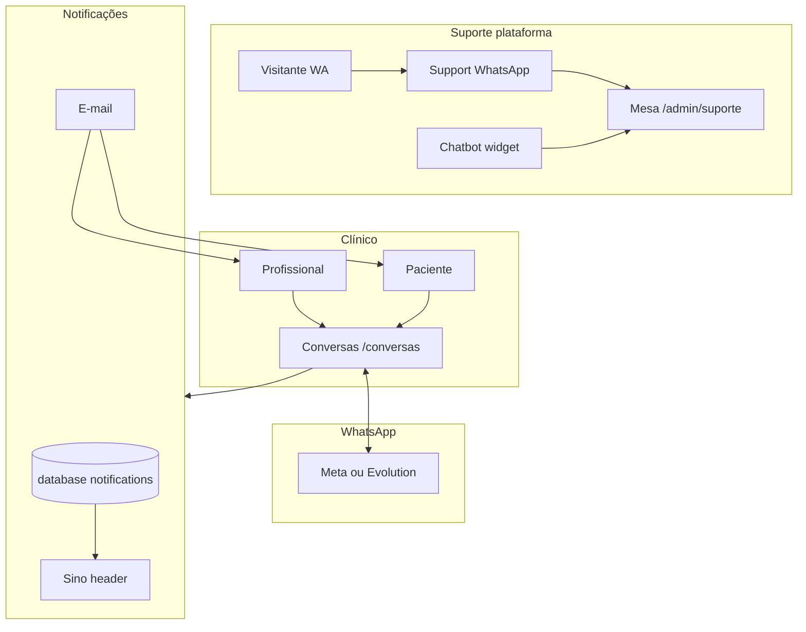

# PsiConecta — Comunicação, suporte e notificações

> Conversas clínicas, WhatsApp, chatbot, mesa de suporte e alertas in-app.

---

## 1. Visão geral



---

## 2. Conversas clínicas (`/conversas`)

### Funcionalidades
- Inbox profissional ↔ paciente
- Mensagens com corpo encriptado
- Anexos, export PDF, arquivar no prontuário
- Polling para novas mensagens
- Consentimento WhatsApp LGPD (activar, lembrete, revogar)

### Rotas principais
| Rota | Descrição |
|------|-----------|
| `GET /conversas` | Lista de conversas |
| `GET /conversas/{id}` | Thread de mensagens |
| `POST /conversas/{id}/mensagens` | Enviar mensagem |
| `POST /conversas/{id}/whatsapp/*` | Toggle e consentimento WA |

### Modelos
- `Conversation`, `ConversationMessage`
- Separado de `support_conversations` (suporte plataforma)

---

## 3. WhatsApp

### Drivers (`WHATSAPP_DRIVER`)

| Driver | Uso |
|--------|-----|
| `meta` | WhatsApp Cloud API (oficial Meta) |
| `evolution` | Evolution API self-hosted (Docker) |

### Fluxo clínico
1. Profissional activa WhatsApp na conversa
2. Paciente recebe pedido de consentimento (LGPD)
3. Mensagens espelhadas entre app e WhatsApp
4. Webhook recebe inbound → `WhatsAppIncomingHandler`

### Webhooks API
| Endpoint | Método |
|----------|--------|
| `/api/v1/integrations/whatsapp/webhook` | GET verify + POST (Meta) |
| `/api/v1/integrations/evolution/webhook` | POST (Evolution) |

### Admin
- `GET /admin/integracoes/whatsapp` — testar conexão, sincronizar webhook
- Comando: `php artisan psiconecta:evolution-webhook-sync`

### Variáveis
Ver [CONFIGURACAO.md](CONFIGURACAO.md) secções 8 e 9.

---

## 4. Chatbot e suporte

### 4.1 Widget (`/chatbot/widget`)
- Disponível para utilizadores autenticados
- Intents configuráveis em `/admin/chatbot/intents`
- Respostas por regras + opcional LLM (`CHATBOT_AI_ENABLED`)

### 4.2 Apoio ao paciente (`/conversas/apoio`)
- Canal de suporte da plataforma (não clínico)
- Paciente fala com equipa de suporte

### 4.3 Mesa de suporte (`/admin/suporte`)
**Perfis:** `admin` ou `support_agent` (middleware `support.desk`)

| Acção | Descrição |
|-------|-----------|
| Assumir | Agente toma conversa |
| Transferir | Passa a outro agente |
| Resolver / Encerrar | Fecha protocolo |

### 4.4 WhatsApp suporte (`CHATBOT_WHATSAPP_ENABLED`)
- Visitantes (sem `user_id`) criam `support_conversation`
- Menu numerado via `ChatbotMenuService`
- Handoff para agente quando `bot_active=false`
- Match de telefone com variantes `55` (`phoneDigitVariants`)

### Serviços chave
| Serviço | Ficheiro |
|---------|----------|
| `SupportWhatsAppHandler` | Inbound WA suporte |
| `SupportDeskService` | Fila e atribuição |
| `ChatOrchestratorService` | Widget |
| `ChatbotMenuService` | Menus numerados |

---

## 5. Notificações

### Canais
- **database** — feed in-app (sino no header + secção dashboard/portal)
- **mail** — e-mail transaccional

### Tipos (`app/Notifications/`)

| Notificação | Destinatário | Evento |
|-------------|--------------|--------|
| `NewConversationMessageNotification` | Pro / Pac | Nova mensagem |
| `PatientPaymentDueNotification` | Paciente | Cobrança / lembrete |
| `ProfessionalClinicalPaymentNotification` | Profissional | Pagamento confirmado/atraso |
| `SubscriptionExpiringNotification` | Profissional | Assinatura a expirar |
| `TherapySessionTomorrowReminder` | Pro / Pac | Sessão amanhã |
| `PatientPortalInvitationNotification` | Paciente | Convite portal |
| `ClinicTeamInvitationNotification` | Profissional | Convite equipa |
| `WhatsAppConsentReminderNotification` | Paciente | Consentimento WA |

### UI
- `x-notifications-bell` — dropdown header (variantes `clinical` / `patient`)
- `x-notifications-feed` — lista em dashboard e portal
- `NotificationPresenter` — título, mensagem, ícone, tom, URL acção

### Rotas
| Rota | Descrição |
|------|-----------|
| `GET /notificacoes/{id}/abrir` | Abre e marca lida |
| `POST /notificacoes/marcar-todas-lidas` | Marca todas |

### Lembretes agendados
- Assinatura: 08:00
- Pagamentos: 09:00
- Sessões: 07:00

---

## 6. Autenticação social (comunicação de contas)

- Tabela `social_accounts` liga Google/Facebook ao `users`
- Contas só sociais: `password` nullable; definir senha no perfil
- Ver [APLICACAO.md](APLICACAO.md) secção 3 (actualizada)

---

## 7. Segurança e LGPD

- Corpos de mensagem encriptados (`encrypt-message-bodies` migration)
- Consentimento explícito para WhatsApp clínico
- Auditoria em acções sensíveis (`AuditTrail`)
- Throttle em exports e webhooks

---

## 8. Testes relacionados

```
tests/Feature/ConversationTest.php
tests/Feature/ConversationPhase2Test.php
tests/Feature/ConversationPhase3Test.php
tests/Feature/SupportDeskTest.php
tests/Feature/SupportWhatsAppTest.php
tests/Feature/ChatbotWidgetTest.php
tests/Feature/EvolutionWhatsAppTest.php
tests/Feature/NotificationOpenTest.php
tests/Unit/NotificationPresenterTest.php
```

---

*Índice geral: [README.md](README.md)*
