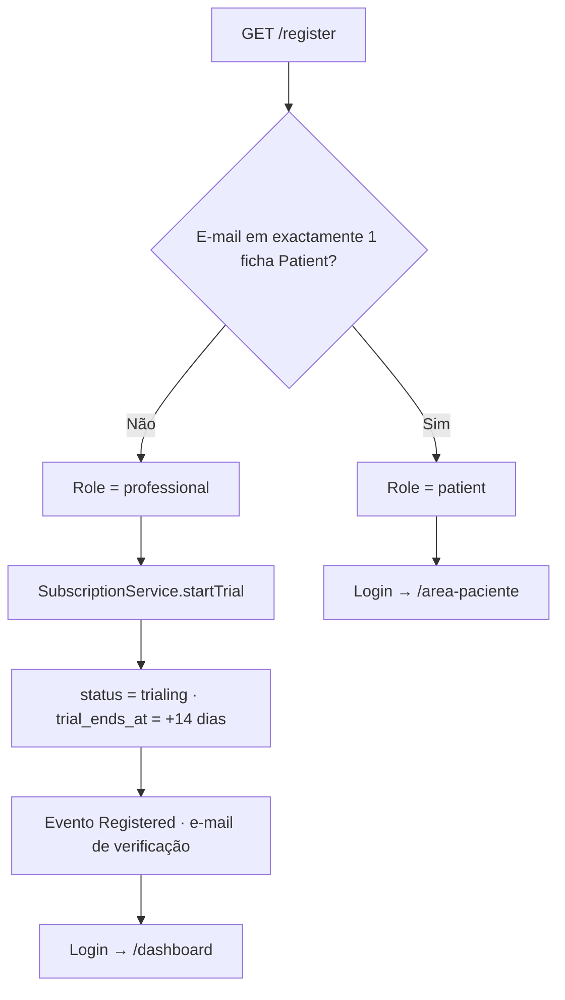
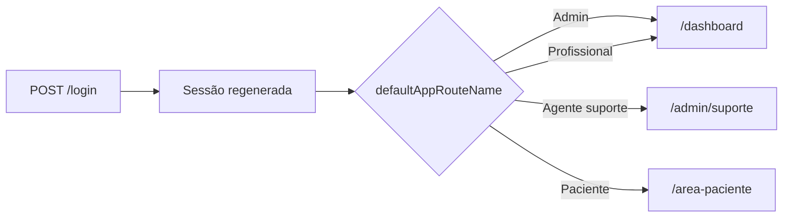
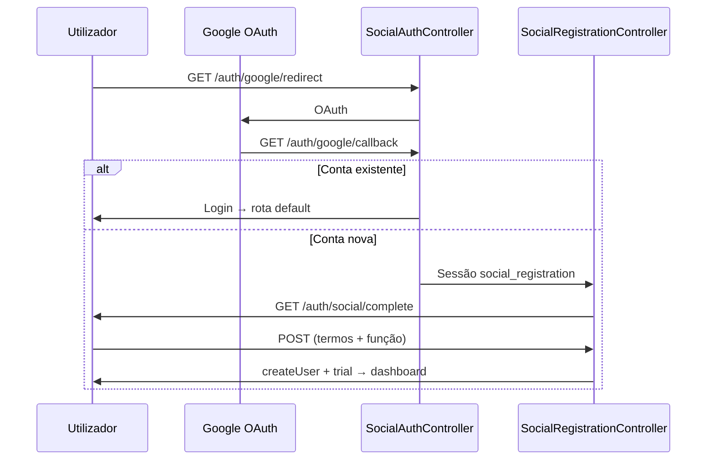
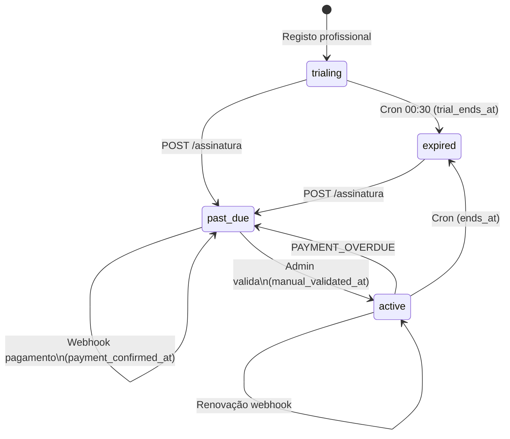
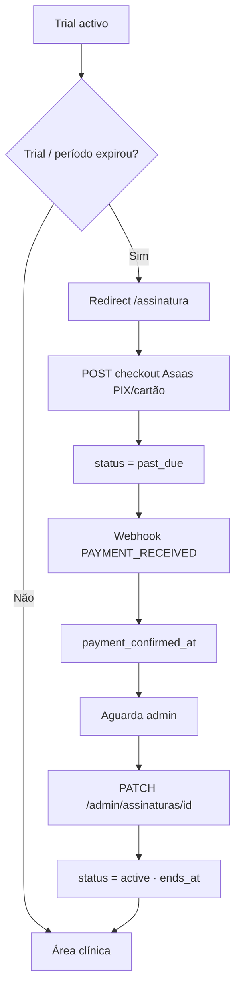
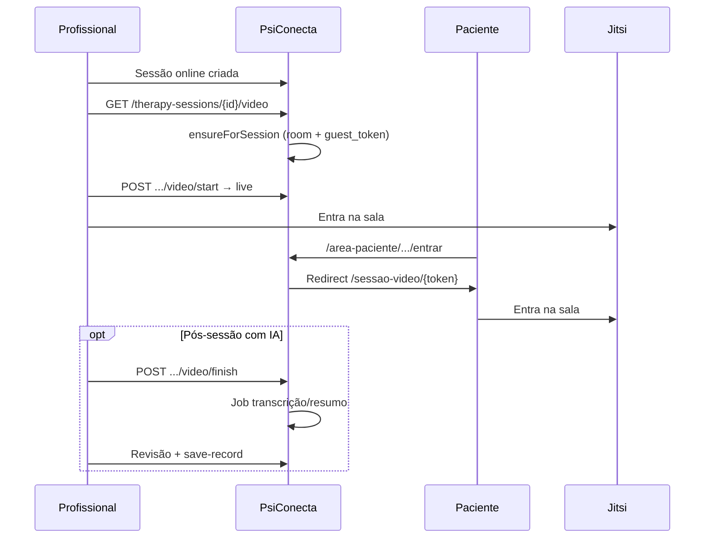
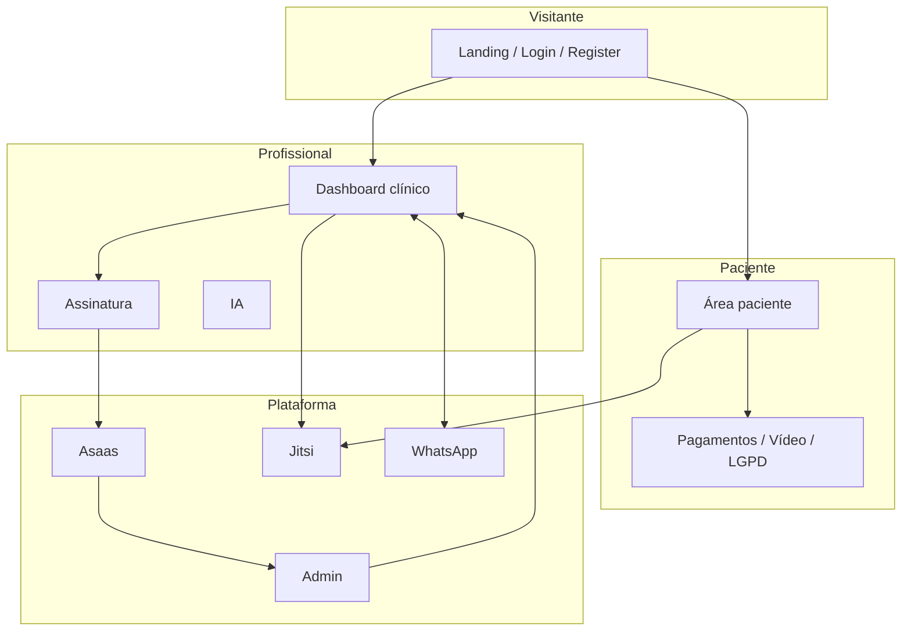

# PsicoVita / PsiConecta — Fluxos de funcionamento

> Visão operacional dos principais fluxos da aplicação.  
> Última atualização: julho de 2026.  
> Complementa os [manuais](README.md) e a documentação em [`docs/`](../docs/README.md).

---

## Índice

| # | Fluxo | Actores |
|---|--------|---------|
| 1 | [Cadastro e onboarding do profissional](#1-cadastro-e-onboarding-do-profissional) | Visitante → Profissional |
| 2 | [Login e autenticação social](#2-login-e-autenticação-social) | Utilizador |
| 3 | [Assinatura SaaS](#3-assinatura-saas) | Profissional, Asaas, Admin |
| 4 | [Gestão clínica](#4-gestão-clínica) | Profissional / equipa |
| 5 | [Portal do paciente](#5-portal-do-paciente) | Paciente |
| 6 | [Teleconsulta (Jitsi)](#6-teleconsulta-jitsi) | Profissional, Paciente, convidados |
| 7 | [WhatsApp, chatbot e suporte](#7-whatsapp-chatbot-e-suporte) | Profissional, Paciente, Admin |
| 8 | [Administração](#8-administração) | Admin, DPO, agentes |
| 9 | [Assistente de IA](#9-assistente-de-ia) | Profissional (plano com IA) |

---

## Camadas de acesso (transversal)

```mermaid
flowchart TB
    U[Utilizador autenticado] --> V{E-mail verificado?}
    V -->|Não| VE[/verify-email]
    V -->|Sim| R{Papel}
    R -->|Paciente| PP[/area-paciente]
    R -->|Admin| AD[/dashboard + /admin]
    R -->|Profissional| PR{subscription.access}
    PR -->|Trial ou active| CL[Área clínica]
    PR -->|Bloqueado| AS[/assinatura]
```

| Middleware | Função |
|------------|--------|
| `auth` + `verified` | Sessão e e-mail confirmado |
| `professional` | Só profissionais na área clínica |
| `subscription.access` | Trial válido ou assinatura activa |
| `subscription.feature:{x}` | Feature do plano (`use_ai`, `multi_user`, …) |
| `patient.portal` | Dados sensíveis do titular no portal |
| `lgpd.admin` | Admin ou DPO |
| `support.desk` | Admin ou agente de suporte |

**Excepções sem assinatura activa:** `/assinatura`, `/profile`, carteira Asaas.

---

## 1. Cadastro e onboarding do profissional

**Objectivo:** criar conta e iniciar trial de 14 dias (`SUBSCRIPTION_TRIAL_DAYS`).



| Passo | Detalhe |
|-------|---------|
| 1 | Landing `GET /` ou formulário `GET/POST /register` |
| 2 | Validação: nome, e-mail único, senha, termos, função profissional |
| 3 | `UserRegistrationService` resolve papel (paciente vs profissional) |
| 4 | Profissional: trial automático, plano slug `trial` |
| 5 | Login e redirect por `User::defaultAppRouteName()` |

**Limites do trial:** IA disponível; até ~10 pacientes (conforme plano Trial).

---

## 2. Login e autenticação social

### 2.1 E-mail e senha



### 2.2 Google (Socialite)



| Rota | Função |
|------|--------|
| `/login` | Sessão e-mail/senha |
| `/auth/{provider}/redirect` | Início OAuth (`google`) |
| `/auth/{provider}/callback` | Retorno OAuth |
| `/auth/social/complete` | Completar registo social |

**Caso especial:** profissional cujo e-mail já existe noutra ficha de paciente pode ser redireccionado para o portal (`usesPatientPortalExperience`).

---

## 3. Assinatura SaaS

**Objectivo:** manter acesso clínico após o trial (pagamento + validação admin).

### 3.1 Estados

| Estado | Acesso clínico | Notas |
|--------|----------------|-------|
| `trialing` | Sim (até `trial_ends_at`) | Criado no registo |
| `active` | Sim (até `ends_at`) | Plano pago + validado |
| `past_due` | Não | Checkout ou aguarda admin |
| `expired` | Não | Trial/plano terminou |
| `cancelled` | Até `ends_at` | Renovação parada |



### 3.2 Fluxo ponta a ponta



| Fase | Quem | O quê |
|------|------|--------|
| A — Trial | Sistema | `startTrial()` no registo |
| B — Bloqueio | Middleware | `subscription.access` → `/assinatura` |
| C — Checkout | Profissional | `GET/POST /assinatura` · planos Essencial / Premium / Clínica |
| D — Pagamento | Asaas | `POST /webhooks/asaas` → `confirmFromWebhook()` |
| E — Validação | Admin | `/admin/assinaturas/{id}/validar` (se `SUBSCRIPTION_REQUIRE_ADMIN_AFTER_PAYMENT=true`) |
| F — Activação | Sistema | Dupla aprovação → `active` |

**Isentos:** administradores; membros de equipa usam a assinatura do titular.

### 3.3 Features por plano (resumo)

| Feature | Trial | Essencial | Premium | Clínica |
|---------|-------|-----------|---------|---------|
| CRUD clínico | ✓ | ✓ | ✓ | ✓ |
| `use_ai` | ✓ | — | ✓ | ✓ |
| `multi_user` | — | — | — | ✓ |
| Limite pacientes | ~10 | ~50 | ∞ | ∞ |

### 3.4 Comandos agendados

| Comando | Horário | Efeito |
|---------|---------|--------|
| `psiconecta:expire-subscriptions` | 00:30 | → `expired` |
| `psiconecta:subscription-reminders` | 08:00 | Aviso de expiração |

---

## 4. Gestão clínica

**Middleware:** `auth` + `verified` + `professional` + `subscription.access`

```mermaid
flowchart TB
    D[/dashboard] --> P[Pacientes /patients]
    D --> A[Agenda /agenda]
    D --> S[Sessões /therapy-sessions]
    D --> CR[Prontuário /clinical-records]
    D --> R[Relatórios /relatorios]
    D --> M[Mensagens /conversas]
    P --> INV[Convite portal]
    P --> AN[Anamnese / documentos / escalas]
    S --> ST{Status}
    ST -->|completed / cancelled| OK
    S --> AUTO[Observer → cobrança automática opcional]
```

### Pacientes

1. CRUD em `/patients` (quota por plano / `PatientPolicy`).
2. Convite ao portal (e-mail / WhatsApp).
3. Ficha: anamnese, documentos clínicos, escalas, metas terapêuticas.

### Sessões e agenda

| Acção | Rota |
|-------|------|
| Calendário | `GET /agenda` |
| CRUD sessões | `/therapy-sessions` |
| Status rápido | `PATCH .../status` → `completed` \| `cancelled` |
| Bloqueios | `/schedule-blocks` |
| Export | PDF / Excel da agenda |

**Tipos:** `online` \| `in_person` · **Duração típica:** 50 min · conflitos via `ScheduleConflictService`.

### Prontuário

- CRUD `/clinical-records` (conteúdo encriptado, `RecordAccessLog`).
- Opcional: painel IA + `POST /ia/salvar-prontuario`.

---

## 5. Portal do paciente

```mermaid
flowchart TD
    P[Profissional cria Patient] --> I[Convite e-mail/WhatsApp]
    I --> A[GET/POST /portal/activar/TOKEN]
    A --> U[User patient + login]
    U --> H[/area-paciente]
    H --> PAY[/pagamentos]
    H --> VID[/consultas-online]
    H --> LGPD[/privacidade]
    H --> SUP[/conversas/apoio]
    PAY --> ASAAS[Asaas PIX/cartão]
    ASAAS --> WH[Webhook → paid]
```

| Área | Rota | Notas |
|------|------|-------|
| Home | `/area-paciente` | Resumo |
| Pagamentos | `/area-paciente/pagamentos` | Cobranças clínicas (não SaaS) |
| Consultas online | `/area-paciente/consultas-online` | Entrada na sala |
| Privacidade LGPD | `/area-paciente/privacidade` | Pedidos do titular |
| Apoio | `/conversas/apoio` | Suporte da plataforma |

**Estados de pagamento clínico:** `pending` → `paid` \| `overdue` \| `cancelled` \| `refunded`

**Alternativas de entrada:** registo com e-mail já na ficha; login Google; API móvel Sanctum (`/api/v1/patient/...`).

---

## 6. Teleconsulta (Jitsi)



| Actor | Entrada |
|-------|---------|
| Profissional | `/therapy-sessions/{id}/video` |
| Paciente | `/area-paciente/consultas-online/{id}/entrar` → `/sessao-video/{token}` |
| Convidado | `/sessao-video/{token}` (+ consentimento LGPD se gravação) |

**Estados da video call:** `pending` → `live` → `ended`

Config: `JITSI_DOMAIN`, `JITSI_ROOM_PREFIX` · serviço `SessionVideoCallService`.

---

## 7. WhatsApp, chatbot e suporte

Detalhe técnico: [`docs/COMUNICACAO.md`](../docs/COMUNICACAO.md).

```mermaid
flowchart LR
    subgraph Canais
        APP[App /conversas]
        WA[WhatsApp Meta ou Evolution]
        WID[Chatbot widget]
    end
    APP <--> WA
    WID --> BOT[Intents admin]
    BOT -->|Handoff| MESA[/admin/suporte]
    WA -->|Visitante| MESA
    PAC[/conversas/apoio] --> MESA
```

### WhatsApp clínico

1. Conversa em `/conversas/{id}`.
2. Activar canal + consentimento LGPD do paciente.
3. Mensagens espelhadas app ↔ WhatsApp.
4. Webhooks: Meta `/api/v1/integrations/whatsapp/webhook` · Evolution `/api/v1/integrations/evolution/webhook`.

### Chatbot e suporte

| Canal | Rota | Quem responde |
|-------|------|---------------|
| Widget | `/chatbot/widget` | Intents (+ IA opcional) |
| Paciente → apoio | `/conversas/apoio` | Mesa `/admin/suporte` |
| WhatsApp visitante | Handler de suporte | Agentes |
| Admin WhatsApp | `/admin/integracoes/whatsapp` | Config / teste / sync |

---

## 8. Administração

```mermaid
flowchart TB
    AD[Admin / DPO / Agente] --> SUB[/admin/assinaturas]
    AD --> LGPD[/admin/lgpd/*]
    AD --> SUP[/admin/suporte]
    AD --> SITE[/admin/site/*]
    AD --> BOT[/admin/chatbot/intents]
    AD --> WA[/admin/integracoes/whatsapp]
    SUB --> VAL[Validar pagamento SaaS]
    LGPD --> SOL[Solicitações · métricas · auditoria]
```

### Validar assinatura

1. `GET /admin/assinaturas` — lista.
2. `GET /admin/assinaturas/{id}/validar` — formulário.
3. `PATCH` → exige pagamento confirmado → `manual_validated_at` → `active`.

### LGPD

| Rota | Função |
|------|--------|
| `/admin/lgpd/metricas` | KPIs / SLA |
| `/admin/lgpd/solicitacoes` | Pedidos dos titulares |
| `/admin/lgpd/auditoria` | Logs + export |

**Estados do pedido:** `pending` → `in_progress` → `completed` \| `rejected`

### Site

- Planos / preços: `/admin/site/planos`
- Redes sociais e parceiros: `/admin/site/...`

---

## 9. Assistente de IA

**Pré-requisito:** feature `use_ai` (Trial, Premium, Clínica).

```mermaid
flowchart LR
    P[/ia-assistente] --> T[POST /ia/transcrever-audio]
    P --> G[POST /ia/gerar-texto]
    P --> R[POST /ia/recomendar-terapeuta]
    T --> AR[AiRequest: processing → completed]
    G --> AR
    AR --> CR[POST /ia/salvar-prontuario]
    VID[video/finish] --> JOB[ProcessSessionVideoRecordingJob]
    JOB --> REV[/video/review]
    REV --> CR
```

| Capacidade | Rota |
|------------|------|
| Painel | `GET /ia-assistente` |
| Transcrição | `POST /ia/transcrever-audio` |
| Texto clínico | `POST /ia/gerar-texto` |
| Recomendação | `POST /ia/recomendar-terapeuta` |
| Guardar no prontuário | `POST /ia/salvar-prontuario` |

**Provedores:** OpenAI/ChatGPT · Claude · Gemini · Ollama (local) · `mock` (`AI_PROVIDER`).

---

## Visão geral dos actores



---

## Referências

| Documento | Uso |
|-----------|-----|
| [MANUAL_PACIENTE.md](MANUAL_PACIENTE.md) | Como o paciente usa o portal |
| [MANUAL_ADMINISTRADOR.md](MANUAL_ADMINISTRADOR.md) | Validação, LGPD, suporte |
| [MANUAL_TECNICO.md](MANUAL_TECNICO.md) | `.env`, deploy, cron |
| [docs/APLICACAO.md](../docs/APLICACAO.md) | Funcionalidades, ERD, rotas |
| [docs/COMUNICACAO.md](../docs/COMUNICACAO.md) | WhatsApp e notificações |
| [docs/CONFIGURACAO.md](../docs/CONFIGURACAO.md) | Variáveis de ambiente |

---

*Actualize este documento quando alterar estados de assinatura, middleware de acesso ou integrações críticas.*
